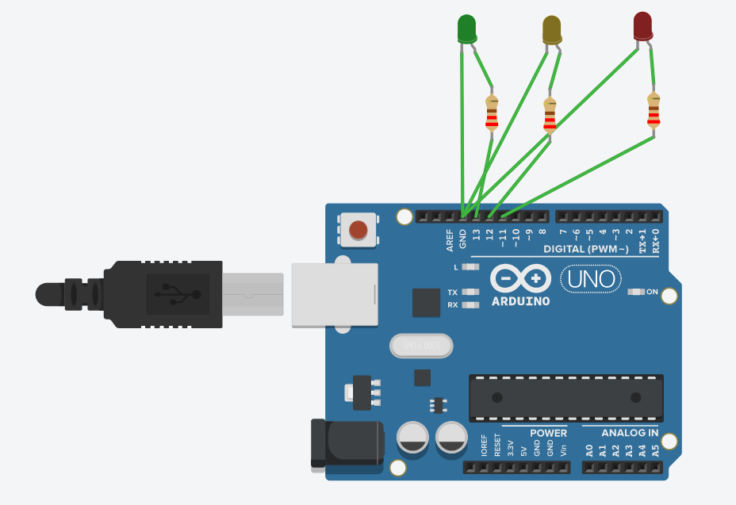
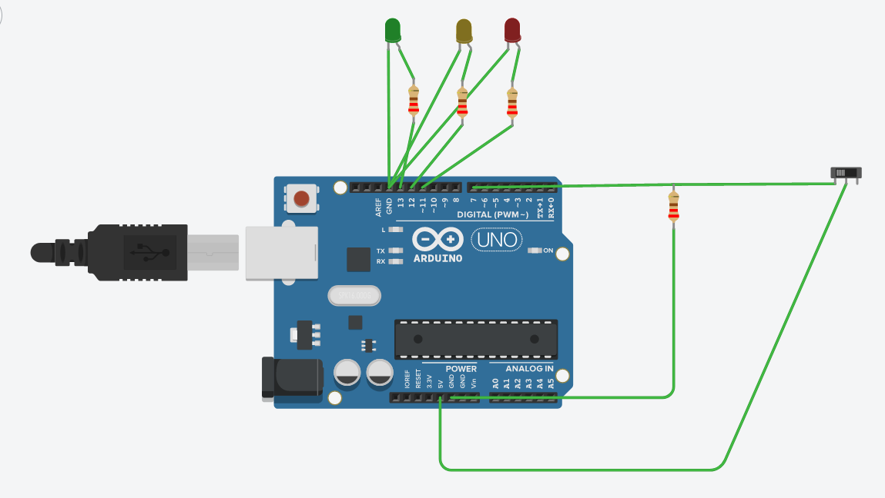

# Práctica 3: Experimentación con Arduino

Alumnos que la han desarrollado:
* Alonso Bueno Herrero
* Bartolomé Zambrana Pérez

Contenido de esta documentación:
* SEMINARIO
  - Ejercicios 1 y 2
* PROYECTOS DE "AMPLIACIÓN"
  - Proyectos 1 y 2

Nota: debido a que Fritzing, en su web, exigía pagar para descargar el software, se ha usado el simulador de Tinkercad para las fases de diseño y simulación del circuito. 

## SEMINARIO: Ejercicio 1: Parpadeo de LED básico

Esquema del circuito: 

Componentes eléctricos usados:
* Placa ARDUINO
* 3 Resistencias de 220 ohmios
* 3 leds rojo, amarillo y verde
* cables para conexiones

<video width="320" height="240" controls>
  <source src="s3-ejercicio1.mp4" type="video/mp4">
</video>

## SEMINARIO: Ejercicio 2: Parpadeo de LED con interruptor

Esquema del circuito:

Componentes eléctricos usados:
* Placa ARDUINO
* 4 Resistencias de 220 ohmios
* 3 leds rojo, amarillo y verde
* cables para conexiones
* Interruptor* 

(*) Para conectar un interruptor y captar su estado, nos hemos apoyado en lo expuesto en [este blog](http://www.practicasconarduino.com/manualrapido/montaje_1_interruptor.html) educativo de Arduino, muy interesante.

<video width="320" height="240" controls>
  <source src="s3-ejercicio2.mp4" type="video/mp4">
</video>

