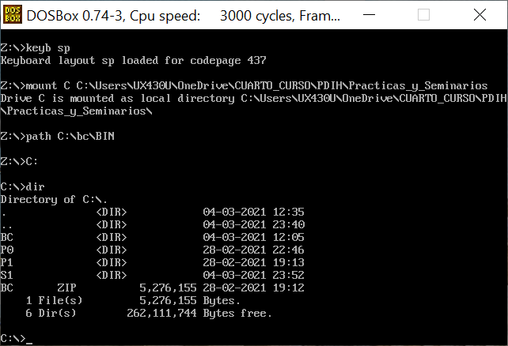
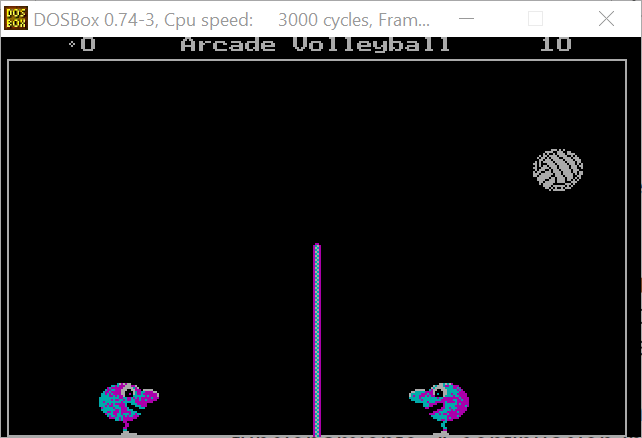
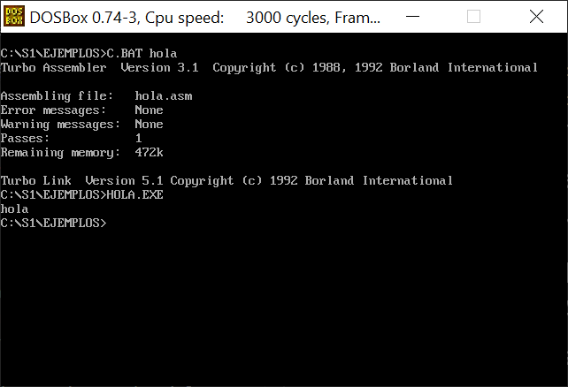
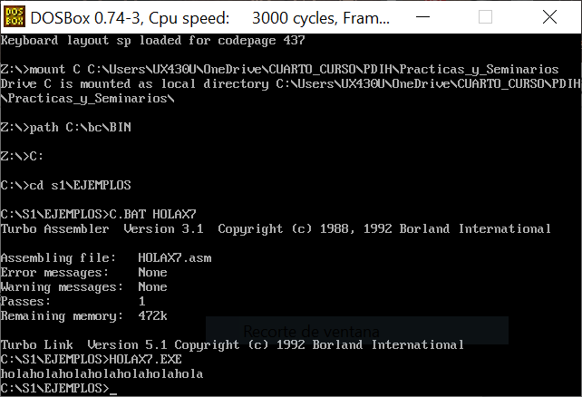

# Seminario 1: Programación de dispositivos a bajo nivel

Solución de los ejercicios propuestos.

ALUMNO:
* Alonso Bueno Herrero

## Ejercicio 1. Instalar el software DOSBox y ejecutar aplicaciones de MS-DOS (p.ej. juegos clásicos).

Tras instalar el ejecutable, hay que abrir el fichero de configuración, ubicado en mi caso en `C:\Users\UX430U\AppData\Local\DOSBox\dosbox-0.74-3.conf` y añadir, al final, el siguiente contenido:

```
[autoexec]
# Lines in this section will be run at startup.
# You can put your MOUNT lines here. 
# (Alonso Bueno Herrero, 2021)

# Poner en español
keyb sp  
# montar directorio de trabajo al principio de cada sesión
mount C C:\Users\UX430U\OneDrive\CUARTO_CURSO\PDIH\Practicas_y_Seminarios\bc
path C:\bc\BIN
```

Y una vez hechas esas modificaciones del fichero de configuración, lo guardamos y lo dejamos en el mismo directorio en que está. 

Ahora, cada vez que arranquemos DOSBOX se ejecutarán estas líneas y tendremos nuestro *path* listo y también nuestra carpeta de trabajo (donde está `bc`) montada. 

La comprobación de que nuestro DOSBOX arranca correctamente se puede ver en la figura siguiente:




Vamos a ejecutar algún juego. He escogido el de VBALL, que hemos probado en clase. Para lanzarlo, basta con irse al directorio en que está, escribir su nombre en la línea de comandos y lanzarlo. Una captura de una partida que he realizado:



## Ejercicio 2. Configurar el inicio de DOSBox para que monte en la unidad C: el directorio donde se encuentra el entorno de programación Borland C (que incluye las herramientas para compilar no sólo lenguaje C, sino también ensamblador). Añadir a la variable “PATH” de inicio el directorio “bin” donde se encuentra el ejecutable BC.EXE. 

Lo que se pide en este ejercicio ya se ha resuelto en las dos últimas líneas del fragmento del fichero de configuración del Ejercicio 1. Más concretamente:

1. Para configurar el inicio y que se monte en C: la carpeta padre de mi `bc` se usa la sentencia `mount C C:\Users\UX430U\OneDrive\CUARTO_CURSO\PDIH\Practicas_y_Seminarios\bc`.
2. Para fijar el path hacia el ejecutable del compilador, se usa `path C:\bc\BIN`, siendo `BIN` la carpeta de `bc` que contenía el ejecutable, tal y como lo descargué de SWAD.


## Ejercicio 3. Crear el ejemplo “Hola mundo” en ensamblador, compilarlo y comprobar su funcionamiento. A continuación incluir un bucle para mostrar el mensaje 7 veces.

### Fichero `hola.asm` (holamundo clásico)

Tras descargar los ficheros de prueba del Seminario, he ejecutado el script `hola.asm` disponible. Para la compilación, he usado también el fichero `c.bat`:

```
C:\S1\ejemplos>c.bat hola
```

Y la ejecución se muestra en la captura (junto a los resultados de la compilación):



### Programa *holamundo* que muestre el mensaje 7 veces

El código se muestra a continuación. Ha bastado modificar el código del `hola.asm` tal que se ejecute el bucle especificado en el documento del Seminario 1. La compilación y ejecución se muestran en la captura que hay bajo el código.

```
pila segment stack 'stack'
	dw 100h dup (?)
pila ends
datos segment 'data'
	msg db 'hola$'
datos ends
codigo segment 'code'
	assume cs:codigo, ds:datos, ss:pila
	main PROC
		mov ax,datos
		mov ds,ax

		;imprimir N veces una cadena (hasta aqui todo es igual)
		mov cx,0
		bucle:
			mov dx,OFFSET msg
			mov ah,9
			int 21h
			;actualizar contador y comprobar condición
			inc cx
			cmp cx,7
			jne bucle

		mov ax,4c00h   ; terminar y salir
		int 21h
	main ENDP
codigo ends

END main
``` 

